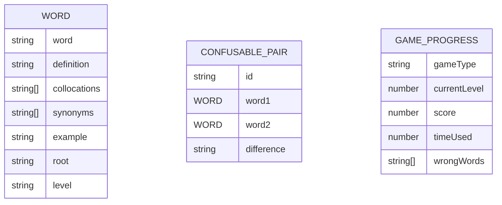

## 1. Architecture Design
```mermaid
graph TB
    subgraph Frontend
        A[React App]
        B[Components]
        C[Pages]
        D[State Management]
        E[Word Data]
    end
    subgraph Data Storage
        F[LocalStorage]
    end
    A --&gt; B
    A --&gt; C
    A --&gt; D
    A --&gt; E
    D --&gt; F
```

## 2. Technology Description
- Frontend: React@18 + TypeScript + tailwindcss@3 + vite
- Initialization Tool: vite-init
- Backend: None（单机应用）
- Database: LocalStorage（存储游戏进度和错题）

## 3. Route Definitions
| Route | Purpose |
|-------|---------|
| / | 首页 - 游戏模式选择 |
| /tower | 词汇阶梯爬塔 |
| /trap | 词义陷阱大考验 |
| /chamber | 盲词记忆密室 |
| /reverse | 单词逆向速答 |

## 4. API Definitions
无后端API，纯前端应用

## 5. Server Architecture Diagram
无后端服务

## 6. Data Model
### 6.1 Data Model Definition


### 6.2 单词数据结构
```typescript
interface Word {
  word: string;
  definition: string;
  collocations: string[];
  synonyms: string[];
  example: string;
  root?: string;
  level: 'cet4' | 'cet6' | 'kaoyan' | 'ielts';
}

interface ConfusablePair {
  id: string;
  word1: Word;
  word2: Word;
  difference: string;
}

interface GameProgress {
  gameType: string;
  currentLevel: number;
  score: number;
  timeUsed: number;
  wrongWords: string[];
}
```

