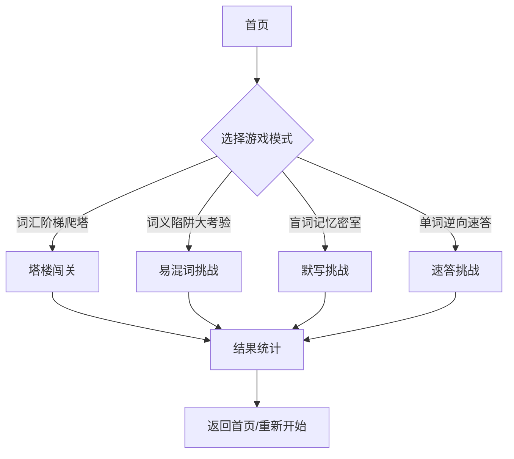

## 1. Product Overview
单机专属高阶单词闯关游戏，主打高级词汇背诵与巩固，提供四种沉浸式玩法模式。
- 面向需要掌握四六级、考研、雅思等高级词汇的英语学习者
- 目标是通过多样化的游戏化模式提升背词效率和记忆深度

## 2. Core Features

### 2.1 User Roles
单机应用，无用户角色区分

### 2.2 Feature Module
1. **首页**：游戏模式选择入口，包含四种玩法卡片展示
2. **词汇阶梯爬塔**：15层塔楼闯关，每层5个单词，限时挑战
3. **词义陷阱大考验**：易混词辨析挑战，错题回顾功能
4. **盲词记忆密室**：中文释义默写，词根词缀推导
5. **单词逆向速答**：快速反应模式，中文→英文速答

### 2.3 Page Details
| Page Name | Module Name | Feature description |
|-----------|-------------|---------------------|
| 首页 | 游戏模式选择 | 四种玩法卡片，点击进入对应模式 |
| 词汇阶梯爬塔 | 塔楼界面 | 显示当前层数、倒计时、计分、单词展示、答案输入 |
| 词汇阶梯爬塔 | 结果统计 | 显示通关层数、用时、正确率 |
| 词义陷阱大考验 | 挑战界面 | 展示易混词组，限时选择区分 |
| 词义陷阱大考验 | 错题回顾 | 展示之前答错的单词，再次挑战 |
| 盲词记忆密室 | 默写界面 | 显示中文释义，输入英文单词 |
| 单词逆向速答 | 速答界面 | 随机显示提示，限时输入英文单词 |

## 3. Core Process
用户从首页选择游戏模式 → 进入对应游戏界面开始挑战 → 完成挑战查看结果 → 返回首页或重新开始

## 4. User Interface Design
### 4.1 Design Style
- **主色调**：深蓝色（#1e3a5f）与金色（#d4af37）的奢华学术风格
- **辅助色**：深灰蓝（#2d4a6f）、浅金（#f0e6d2）
- **按钮风格**：圆角矩形，带有微浮雕效果，悬停有金色光晕
- **字体**：Playfair Display（标题）+ Lato（正文）
- **布局风格**：卡片式设计，带有复古边框装饰
- **图标风格**：金色渐变图标，带有学术气息

### 4.2 Page Design Overview
| Page Name | Module Name | UI Elements |
|-----------|-------------|-------------|
| 首页 | 游戏模式选择 | 四张大卡片，每个卡片带有独特的视觉符号，金色渐变标题，深色背景 |
| 词汇阶梯爬塔 | 塔楼界面 | 竖向塔楼布局，每层显示进度，金色边框倒计时器，深色输入框 |
| 词义陷阱大考验 | 挑战界面 | 左右对比布局，金色高亮正确选项，红色标记错误选项 |
| 盲词记忆密室 | 默写界面 | 打字机效果输入框，深色背景，金色光标 |
| 单词逆向速答 | 速答界面 | 快速切换动画，金色倒计时，极简输入 |

### 4.3 Responsiveness
桌面优先设计，移动端自适应布局，保持核心游戏体验完整

